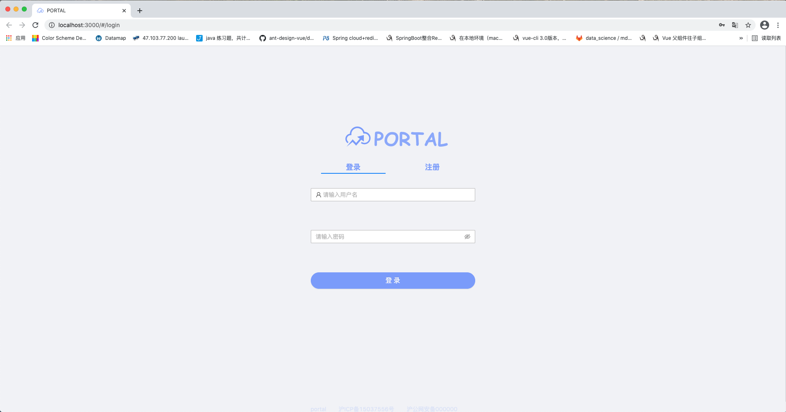
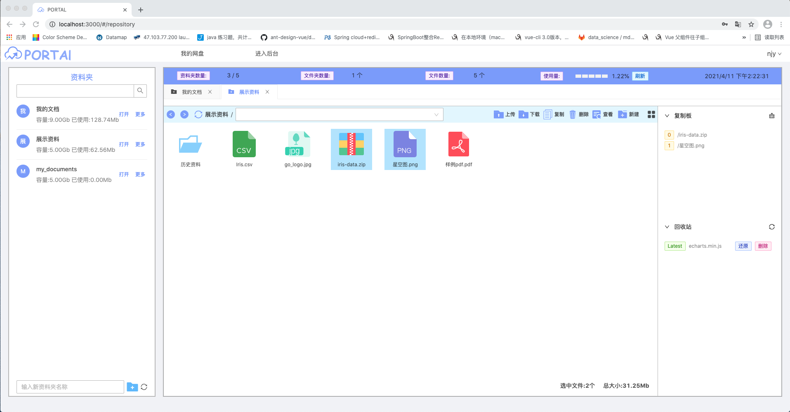
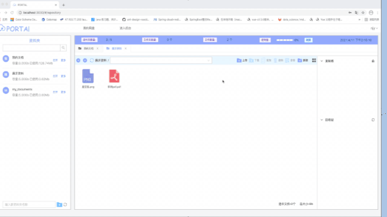
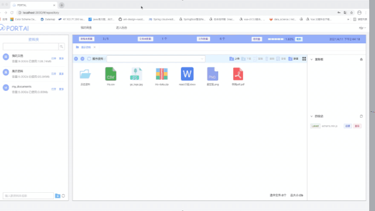
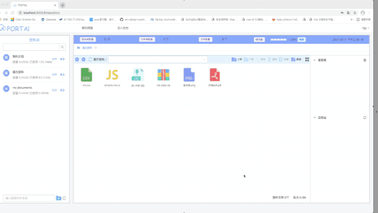
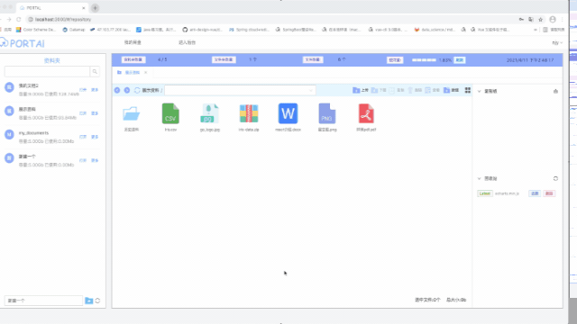
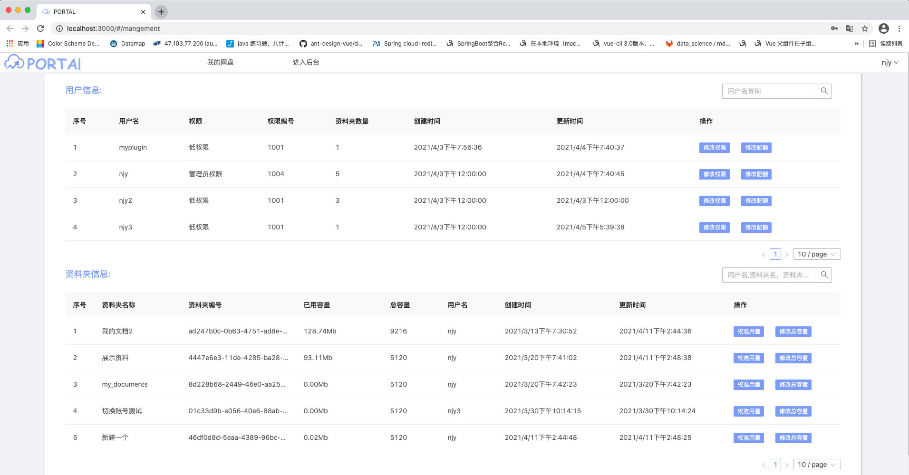

# 

一款基于OSS的快速文件交换，存储的网盘应用

A fast file exchange and storage network disk application based on OSS

**The frontend project URL:**
https://github.com/nijiayu0914/file_exchange_frontend





***

## 主要功能

1）资料分区，文件存储

2）支持同一账号多点同时登陆，支持不同客户端(PC)之间文件互传，共享

3) 支持文件系统常规操作，上传，下载，预览，复制，粘贴，分享

4）对不同文件格式，拥有上百种Icon,支持区分展示

5）拥有回收站功能，防止误删

6）支持版本控制，拥有30天的历史存档记录，可回档

7）拥有极简的后台管理系统，可调整用户配额

***

## 功能演示

#### **上传**



#### **资料夹操作**



#### **文件操作**



#### **高级功能**



#### **管理后台**



***

### How to build image

项目用golang iris web框架开发，并打包成Docker镜像

The project is developed by golang iris framework.

**the way to build the docker image:**

```bash

docker build -t file_exchange:latest .

```

***

### How to run project

**run directly**

1) 编译项目
```bash
go build -ldflags="-s -w" -o compile
```

2) 运行编译后的文件, 默认会读取编译文件目录下 /config/dev/config.yml配置文件，配置文件说明见下文
```bash
/compile
```

3) 自定义配置路径
```bash
  /compile -config_type=file -config_path=./customer_config/config.yml
```

4) 自定义配置路径,配置文件来自于网络。可参考Dockerfile。
```bash
  /compile -config_type=http -config_path=http://192.168.0.132:7000/file_exchange/prod/config.yml
```

**run with docker image**

运行前请先修改Dockerfile最后一行，修改配置文件读取方式

```bash

docker run --name portal --network host -itd -p 8080:8080 file_exchange

```

### 配置文件说明

**详见config/dev/config_example.yml**

Other为自定义配置，其余为Iris framework配置(https://github.com/kataras/iris/blob/master/_examples/configuration/from-yaml-file/configs/iris.yml)

```yaml
DisablePathCorrection: false
EnablePathEscape: false
FireMethodNotAllowed: true
DisableBodyConsumptionOnUnmarshal: true
TimeFormat: Mon, 01 Jan 2006 15:04:05 GMT
Charset: UTF-8
Other:
  Port: 8080 # 服务端口
  Admin: admin # 超级管理员账号名，使用超级管理员登录可进入后台
  AdminPassword: DTJ2dSwcGevGHM93xAMz55EGOxVhqZNDWVkI # 超级管理员密码
  UserCapacity: 5120.0 # 每个资料夹默认最大容量， 可在管理后台修改
  DatabaseType: mysql # 支持 mysql or postgresql 
  DatabaseDsn: "root:123456@tcp(localhost:3306)/public?charset=utf8mb4&parseTime=True&loc=Local" # 具体参考gorm
  RedisDsn: "localhost:6379"
  RedisPassword: "123456"
  RedisDb: 0 # redis 默认数据库编号
  OSSBucket: file-exchange-algo # 阿里云OSS Bucket名称
  OSSEndpoint: oss-cn-shanghai.aliyuncs.com # 阿里云OSS Endpoint
  OSSAccessKeyID: LTAI4*********dw7mp3A # 阿里云OSS AccessKeyID
  OSSAccessKeySecret: pOqFJ3oZO************zln4MNrBH # 阿里云OSS AccessKeySecret
  OSSBucketName: file-exchange-algo # 阿里云OSS Bucket名称
  OSSRegionId: cn-shanghai # 阿里云OSS RegionId
  OSSRamAccessKeyID: LTAI4********Akxagkkm # 阿里云OSS RamAccessKeyID,用于前端STS鉴权，上传文件
  OSSRamAccessKeySecret: yUrvYyoS*********fA9YzeY2G # 阿里云OSS RamAccessKeySecret,用于前端STS鉴权，上传文件
  OSSRoleArn: "acs:ram::1527******086864:role/rule" # 阿里云OSS RoleArn,用于前端STS鉴权，上传文件
  OSSRoleSessionName: anystring # 阿里云OSS RoleSessionName,用于前端STS鉴权，上传文件
  OtherPlugins: {"record_info": true, "icp": "沪ICP备15099999号", "police": "沪公网安备000000号"} # 其他配置，如备案信息等
```

### The frontend project URL

https://github.com/nijiayu0914/file_exchange_frontend


